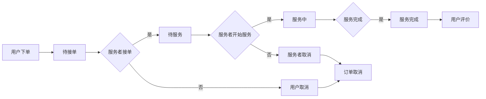

# 丰速行宠物洗护 - 需求文档（PRD）

---

## 1. 产品概述

### 1.1 产品定位
**丰速行宠物洗护**是一款专注于宠物上门洗护服务的移动网页应用，为宠物主人提供便捷、专业的上门宠物护理服务。

### 1.2 产品目标
- 为宠物主人提供便捷的上门洗护预约服务
- 打造专业、安全、私密的宠物护理体验
- 建立宠物护理服务标准化流程

### 1.3 核心价值
| 价值点 | 说明 |
|-------|------|
| **便捷性** | 专业洗护车上门服务，宠物无需外出 |
| **专业性** | 持证美容师一对一服务，恒温洗护设备 |
| **安全性** | 一宠一车，独立洗护空间，无交叉感染 |
| **透明性** | 全程可视，实时追踪服务状态 |

---

## 2. 用户角色

### 2.1 宠物主人（C端用户）
- **核心需求**：便捷预约、透明报价、服务追踪、服务评价
- **使用场景**：为宠物预约洗护服务、查看订单状态、评价服务质量

### 2.2 服务者（B端用户）
- **核心需求**：接单管理、服务导航、状态更新
- **使用场景**：接收订单、导航到服务地点、更新服务状态

### 2.3 管理员
- **核心需求**：订单管理、服务者管理、价格配置
- **使用场景**：处理异常订单、管理服务者账户、调整服务价格

---

## 3. 功能需求

### 3.1 首页模块

| 功能点 | 描述 | 优先级 |
|-------|------|-------|
| 品牌展示 | Logo + 品牌名称展示 | P0 |
| 搜索框 | 搜索服务项目 | P1 |
| 分类导航 | 8个核心服务入口（一键预约、上门洗护、SPA护理、造型美容、口腔护理、指甲护理、耳道清洁、我的宠物） | P0 |
| Banner轮播 | 主推服务展示 | P1 |
| 精选服务 | 服务项目卡片展示（瀑布流布局） | P0 |
| 热门推荐 | 服务热度排行榜 | P1 |

### 3.2 服务详情模块

| 功能点 | 描述 | 优先级 |
|-------|------|-------|
| 服务信息展示 | 服务标题、价格、图片 | P0 |
| 服务描述 | 服务详细介绍 | P0 |
| 服务特色 | 服务亮点列表 | P1 |
| 立即预约 | 跳转预约页面 | P0 |

### 3.3 预约服务模块

| 功能点 | 描述 | 优先级 |
|-------|------|-------|
| 地址选择 | 地图选点 + 手动输入 | P0 |
| 宠物选择 | 从已有宠物列表选择 | P0 |
| 服务项目选择 | 多选服务项目 | P0 |
| 费用明细 | 实时计算并展示费用 | P0 |
| 提交订单 | 确认并提交预约订单 | P0 |

### 3.4 个人中心模块

| 功能点 | 描述 | 优先级 |
|-------|------|-------|
| 用户信息 | 昵称、手机号展示 | P0 |
| 菜单入口 | 宠物信息、订单信息、地址管理、开票 | P0 |

### 3.5 宠物管理模块

| 功能点 | 描述 | 优先级 |
|-------|------|-------|
| 宠物列表 | 展示已添加的宠物 | P0 |
| 添加宠物 | 上传照片、填写名称、类型、体重、毛发 | P0 |
| 编辑宠物 | 修改宠物信息 | P1 |
| 删除宠物 | 移除宠物记录 | P1 |

### 3.6 订单管理模块

#### 3.6.1 订单列表

| 功能点 | 描述 | 优先级 |
|-------|------|-------|
| 订单概览 | 订单号、状态、时间、服务内容、金额 | P0 |
| 状态筛选 | 按状态筛选订单 | P1 |
| 订单详情入口 | 点击进入详情页 | P0 |

#### 3.6.2 订单详情

| 功能点 | 描述 | 优先级 |
|-------|------|-------|
| 地图展示 | 服务地址地图定位 | P0 |
| 订单信息 | 预约时间、服务内容、费用明细 | P0 |
| 服务者信息 | 姓名、电话、评分（待服务及之后状态） | P0 |
| 服务评价 | 星级评分 + 评价留言（服务完成状态） | P0 |
| 取消订单 | 用户取消待接单订单 | P1 |
| 订单状态流转 | 待接单 → 待服务 → 服务中 → 服务完成 | P0 |
| 异常状态 | 订单取消（服务者操作） | P0 |

### 3.7 地址管理模块

| 功能点 | 描述 | 优先级 |
|-------|------|-------|
| 地址列表 | 展示已保存的地址 | P0 |
| 添加地址 | 填写姓名、电话、详细地址、标签 | P0 |
| 编辑地址 | 修改地址信息 | P1 |
| 删除地址 | 移除地址记录 | P1 |
| 地图选点 | 使用高德地图选择位置 | P0 |

### 3.8 开票模块

| 功能点 | 描述 | 优先级 |
|-------|------|-------|
| 订单选择 | 选择可开票的已完成订单 | P0 |
| 发票类型选择 | 个人发票 / 企业发票 | P0 |
| 企业信息填写 | 名称、税号、地址、电话（企业发票） | P0 |
| 邮箱填写 | 接收电子发票的邮箱 | P0 |
| 提交申请 | 提交开票申请 | P0 |

---

## 4. 订单状态流转

### 4.1 状态定义

| 状态码 | 状态名称 | 说明 |
|-------|---------|------|
| pending | 待接单 | 用户下单支付后，等待服务者接单 |
| accepted | 待服务 | 服务者已接单，等待上门服务 |
| serving | 服务中 | 服务者正在提供服务 |
| completed | 服务完成 | 服务已完成，等待评价 |
| canceled | 订单取消 | 订单已取消（用户或服务者操作） |

### 4.2 流转流程



---

## 5. 页面结构

```
├── 首页 (page-home)
│   ├── Logo + 搜索框
│   ├── 分类导航
│   ├── Banner轮播
│   ├── 精选服务
│   └── 热门推荐
│
├── 服务详情页 (page-service-detail)
│   ├── 返回按钮
│   ├── 服务图片
│   ├── 服务标题 + 价格
│   ├── 服务描述
│   ├── 服务特色列表
│   └── 立即预约按钮
│
├── 预约服务页 (page-order)
│   ├── 地址选择（地图 + 输入）
│   ├── 宠物选择
│   ├── 服务项目选择
│   ├── 费用明细
│   └── 提交订单按钮
│
├── 个人中心页 (page-mine)
│   ├── 用户头像 + 昵称 + 手机号
│   └── 功能菜单入口
│
├── 宠物管理页 (page-pets)
│   ├── 宠物列表
│   └── 添加宠物按钮
│
├── 订单列表页 (page-order-list)
│   └── 订单卡片列表
│
├── 订单详情页 (page-order-detail)
│   ├── 地图区域
│   ├── 订单信息
│   ├── 费用明细
│   ├── 服务者信息
│   └── 评价区域（服务完成状态）
│
├── 地址管理页 (page-address)
│   ├── 地址列表
│   └── 添加地址按钮
│
├── 开票页 (page-invoice)
│   └── 订单列表（可开票）
│
└── 发票填写页 (page-invoice-form)
    ├── 订单信息
    ├── 发票类型选择
    ├── 企业信息填写（企业发票）
    ├── 邮箱输入
    └── 提交按钮
```

---

## 6. 非功能需求

### 6.1 性能需求
- 页面加载时间 < 2秒
- 地图加载时间 < 3秒
- 响应式设计，适配各种屏幕尺寸

### 6.2 兼容性需求
- 支持主流移动端浏览器（Chrome、Safari、微信浏览器）
- 支持Android 8.0+ 设备

### 6.3 安全需求
- 用户数据加密传输
- 服务者电话脱敏显示（服务完成状态）
- 支付信息安全处理

### 6.4 用户体验
- 大字体设计，适合手机阅读
- 清晰的视觉反馈
- 流畅的页面切换动画

---

## 7. 技术方案

### 7.1 前端技术栈（UniApp版本）
- **框架**: UniApp + Vue 3
- **语言**: TypeScript
- **构建工具**: Vite
- **地图服务**: 高德地图API
- **样式**: SCSS

### 7.2 项目结构
```
uniapp/
├── src/
│   ├── pages/           # 页面目录
│   │   ├── home/           # 首页
│   │   ├── service-detail/ # 服务详情页
│   │   ├── order/          # 预约服务页
│   │   ├── mine/           # 个人中心页
│   │   ├── pets/           # 宠物管理页
│   │   ├── order-list/     # 订单列表页
│   │   ├── order-detail/   # 订单详情页
│   │   ├── address/        # 地址管理页
│   │   ├── invoice/        # 开票页
│   │   └── invoice-form/   # 发票填写页
│   ├── data/            # 数据模型
│   ├── styles/          # 全局样式
│   ├── App.vue          # 应用入口
│   ├── main.ts          # 主入口文件
│   └── pages.json       # 页面配置
├── package.json         # 依赖配置
├── vite.config.ts       # Vite配置
└── tsconfig.json        # TypeScript配置
```

### 7.3 页面布局
- TabBar底部导航（首页、我的）
- 原生导航栏（除首页外）
- Flexbox + Grid 布局
- 响应式设计适配移动端

### 7.4 颜色方案
- 主色调：青绿色 (#00D4AA)
- 背景色：浅绿色 (#F0FFF8)
- 文字色：深灰色 (#333)
- 辅助色：橙色渐变（价格标签）

### 7.5 构建命令
| 命令 | 说明 |
|-----|------|
| `npm run dev:mp-weixin` | 微信小程序开发模式 |
| `npm run build:mp-weixin` | 微信小程序构建 |
| `npm run dev:h5` | H5开发模式 |
| `npm run build:h5` | H5构建 |

---

## 8. 数据模型

### 8.1 宠物数据
```json
{
    "id": 1,
    "name": "旺财",
    "type": "dog",
    "weight": "medium",
    "hair": "long",
    "avatar": "🐶"
}
```

### 8.2 订单数据
```json
{
    "id": "FSX20240115001",
    "status": "pending",
    "date": "2024-01-15",
    "time": "14:00",
    "address": "北京市朝阳区望京SOHO T1",
    "petId": 1,
    "petName": "旺财",
    "service": "移动洗护车服务",
    "totalPrice": 150,
    "canInvoice": true,
    "provider": null,
    "cancelReason": null
}
```

### 8.3 服务数据
```json
{
    "title": "移动洗护车服务",
    "price": 120,
    "image": "url",
    "description": "专业移动洗护车上门服务",
    "features": ["专车专用", "恒温控制", "专业美容师"]
}
```

---

## 9. 版本历史

| 版本 | 日期 | 描述 |
|-----|------|------|
| V1.0 | 2024-01 | 初始版本，包含核心功能 |

---

**文档版本**: V1.0  
**创建日期**: 2024年1月  
**文档状态**: 正式版

